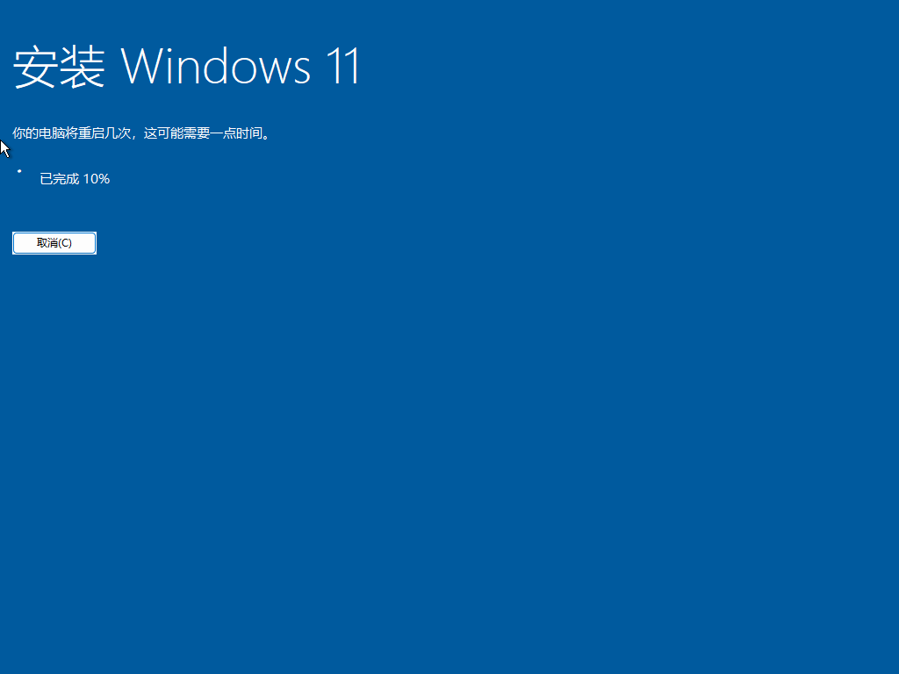
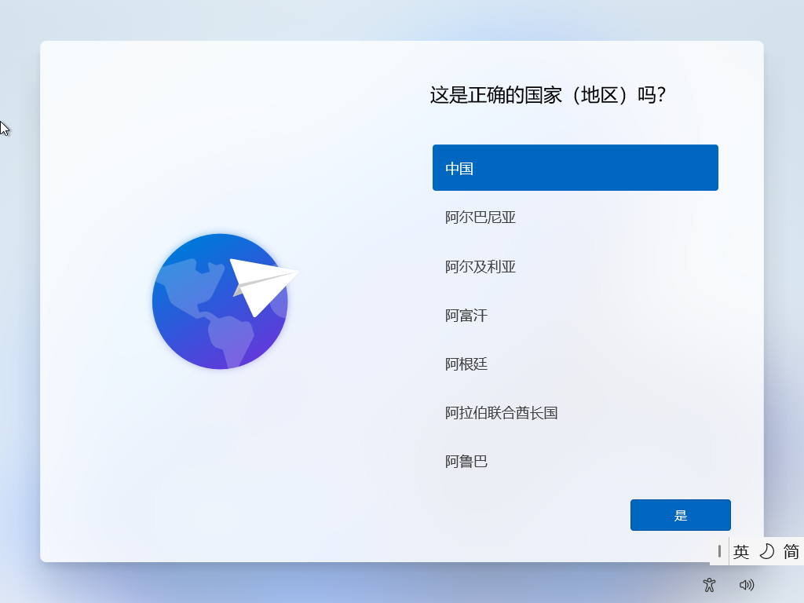
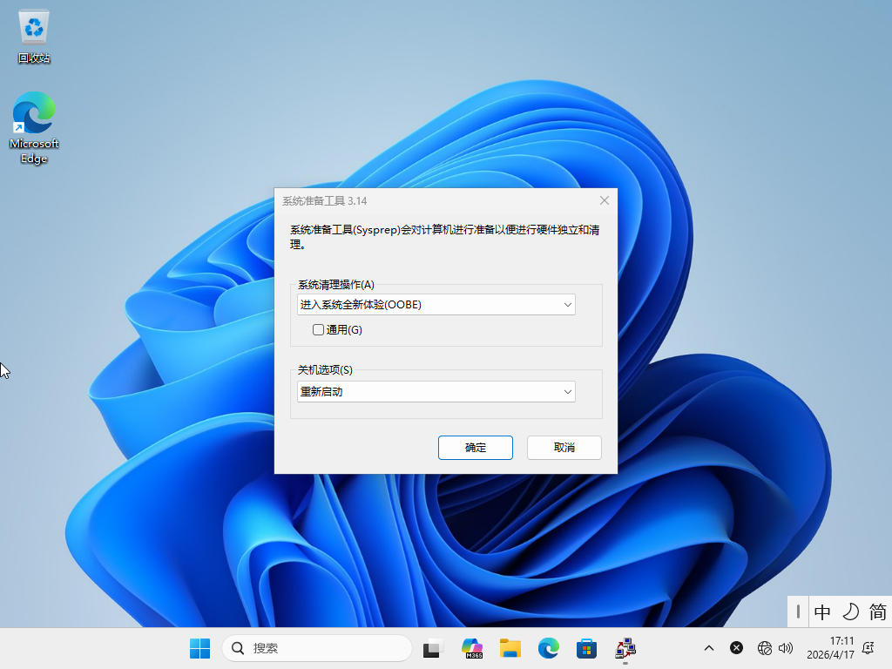
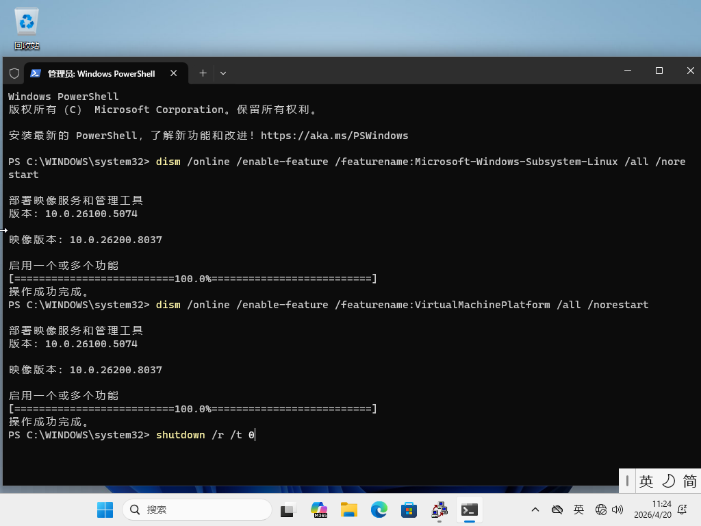
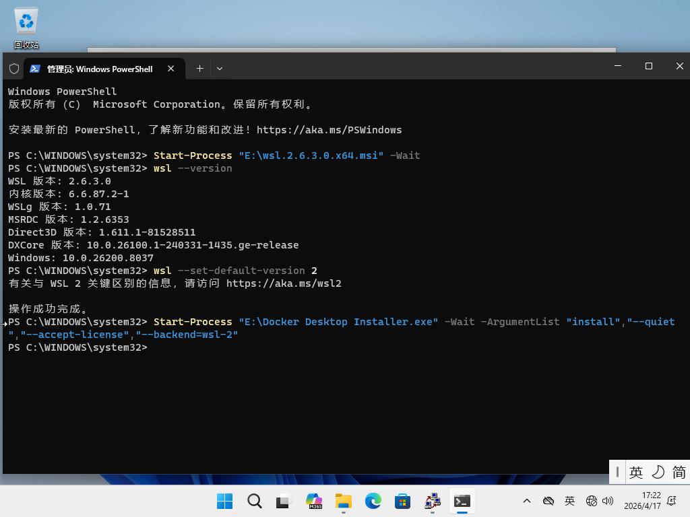
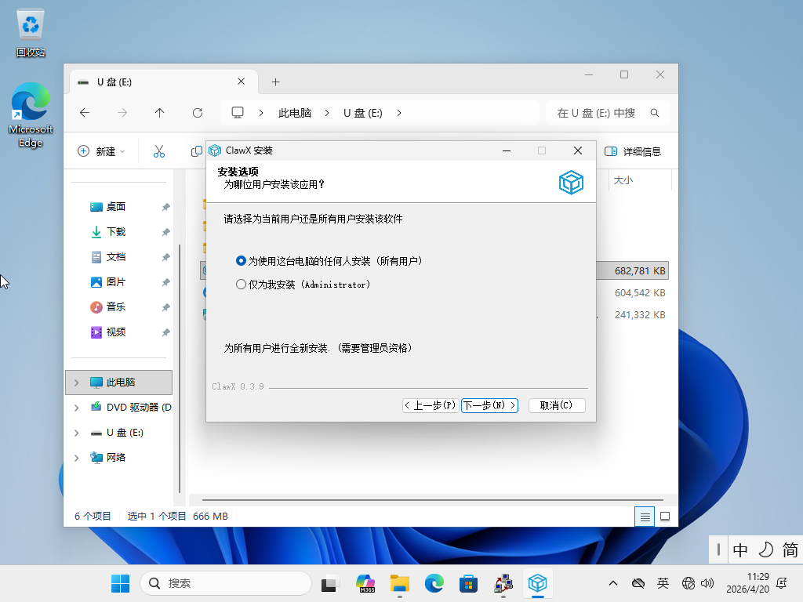
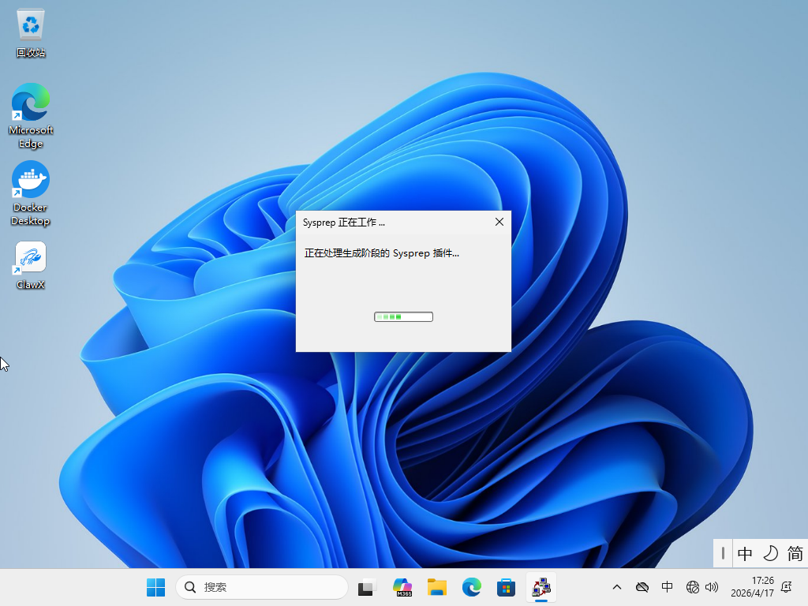
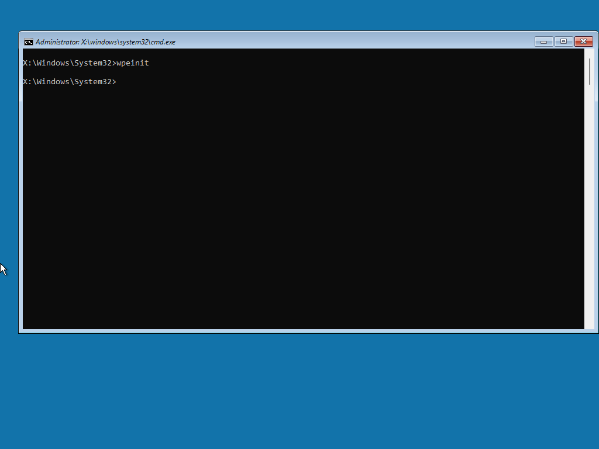
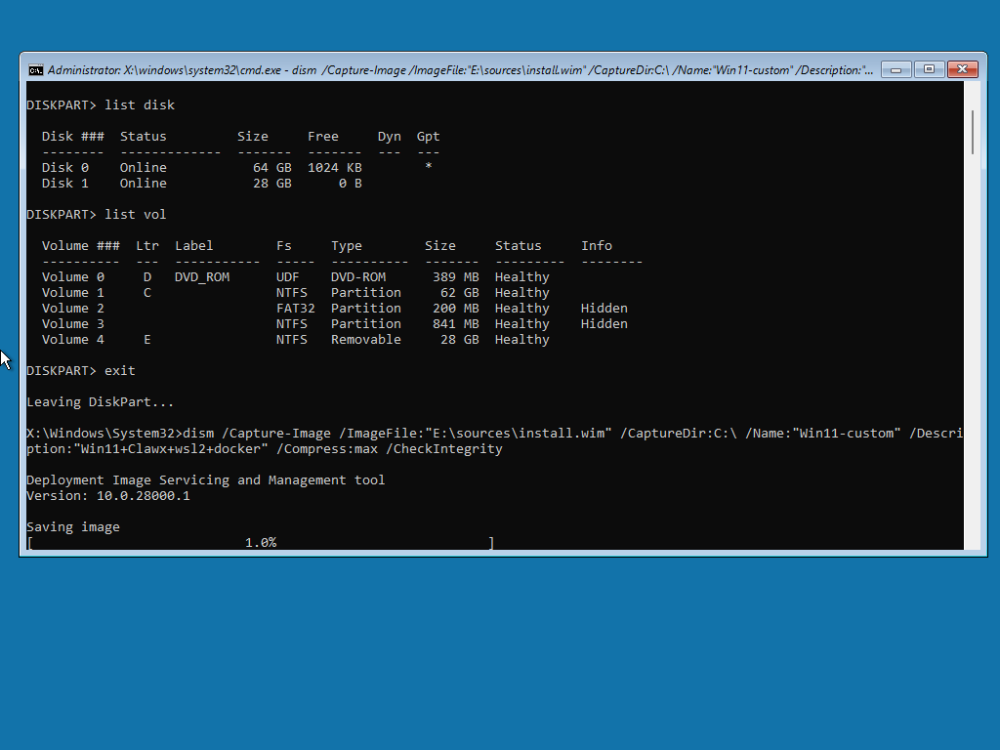

# Windows 11 定制镜像构建全流程

> 从参考机安装 Windows 11 到使用项目构建部署 ISO 的完整指南

---

## 目录

1. [概览](#概览)
2. [环境准备](#环境准备)
3. [阶段一：参考机准备](#阶段一参考机准备)
4. [阶段二：镜像捕获](#阶段二镜像捕获)
5. [阶段三：构建部署介质](#阶段三构建部署介质)
6. [阶段四：部署测试](#阶段四部署测试)
7. [完整命令速查](#完整命令速查)

---

## 概览

### 工作流

```
┌─────────────────────────────────────────────────────────────────┐
│  阶段一：参考机准备                                              │
│                                                                  │
│  安装 Win11 ──→ OOBE 按 Ctrl+Shift+F3 ──→ 进入审计模式          │
│      │                                              │             │
│      └────────────────────────────────────────────┘             │
│                          ↓                                       │
│              安装软件、配置系统、清理                            │
│                          ↓                                       │
│              sysprep /generalize /oobe /shutdown                │
└─────────────────────────────────────────────────────────────────┘
                           ↓
┌─────────────────────────────────────────────────────────────────┐
│  阶段二：镜像捕获                                                │
│                                                                  │
│  启动纯净 WinPE ──→ DISM /Capture-Image ──→ 生成 install.wim    │
│                                                                  │
└─────────────────────────────────────────────────────────────────┘
                           ↓
┌─────────────────────────────────────────────────────────────────┐
│  阶段三：构建部署介质                                            │
│                                                                  │
│  Build-WinPEAutoDeploy.ps1 ──→ 注入自动化脚本到 boot.wim        │
│  Prepare-WinPEUsb.ps1 ──→ 制备 USB 部署盘                       │
│  或                                                              │
│  Generate-WinPEIso.ps1 ──→ 生成部署 ISO                         │
│                                                                  │
└─────────────────────────────────────────────────────────────────┘
                           ↓
┌─────────────────────────────────────────────────────────────────┐
│  阶段四：部署测试                                                │
│                                                                  │
│  目标机启动 WinPE ──→ 自动部署 ──→ 首次登录自动化                │
│                                                                  │
└─────────────────────────────────────────────────────────────────┘
```

### 关键文件

| 文件 | 用途 |
|------|------|
| `install.wim` | 定制的 Windows 镜像（从参考机捕获） |
| `boot.wim` | WinPE 启动镜像（本项目注入自动化脚本） |
| `Docker payload` | 可选的首次登录自动化载荷 |

---

## 环境准备

### 所需工具

| 工具 | 说明 | 下载 |
|------|------|------|
| Windows ADK | Windows 评估和部署套件，至少安装 Deployment Tools | https://learn.microsoft.com/windows-hardware/get-started/adk-install |
| Windows PE add-on | 与 ADK 版本匹配的 WinPE 附加组件 | https://learn.microsoft.com/windows-hardware/get-started/adk-install |
| 本项目 | Win11_custom_deploy | https://github.com/LunarCache/Win11_custom_deploy.git |

### 安装 ADK（管理员 PowerShell）

```powershell
# 下载 ADK (以 Windows 11 ADK 为例)
# 访问 https://learn.microsoft.com/windows-hardware/get-started/adk-install
# 安装时选择：Deployment Tools；随后单独安装匹配版本的 Windows PE add-on

# 验证安装
Test-Path "C:\Program Files (x86)\Windows Kits\10\Assessment and Deployment Kit"
# 应返回 True
```

### 克隆本项目

```powershell
git clone https://github.com/LunarCache/Win11_custom_deploy.git
# 本项目已存在
cd Win11_custom_deploy
```

---

## 阶段一：参考机准备

### 1.1 安装 Windows 11

使用官方 ISO 或 U 盘在参考机上安装 Windows 11。

```
1. 从官方 ISO 启动
2. 选择版本（推荐 Windows 11 专业工作站版本）
3. 选择"自定义安装"
4. 分区：删除所有分区，让安装程序自动创建
5. 等待安装完成
```


### 1.2 进入审计模式

当 OOBE（开箱即用体验）界面出现时：

```
┌─────────────────────────────────────┐
│  "让我们为你设置区域和语言"         │
│                                     │
│  [Ctrl + Shift + F3]               │ ← 按此组合键
│                                     │
└─────────────────────────────────────┘
```


系统将：
1. 跳过 OOBE 用户创建
2. 自动以 `Administrator` 身份登录
3. 进入"审计模式"桌面



**审计模式特点**：
- 无需创建用户账户
- 可以安装软件和驱动
- 显示审计模式页面

### 1.3 安装自定义软件

由于需要使用 wsl 2 需要先在审计模式下先启用相关功能,以管理员身份运行 PowerShell：



```powershell
# 启用 WSL 和虚拟机平台
dism /online /enable-feature /featurename:Microsoft-Windows-Subsystem-Linux /all /norestart
dism /online /enable-feature /featurename:VirtualMachinePlatform /all /norestart
shutdown /r /t 0  # 重启使更改生效
```

重启后在审计模式下安装所需软件：




```powershell
# 示例：以管理员身份运行 PowerShell
# 1. 安装 WSL 2
Start-Process "wsl.exe" -Wait

# 2. 安装 Docker Desktop
Start-Process "Docker Desktop Installer.exe" -ArgumentList "install --quiet --accept-license --backend=wsl-2" -Wait

# 3. 安装其他软件(如ClawX)
# 注意：安装路径应选择在 C:\Program Files\ 或 C:\Program Files (x86)\ 下，避免安装在用户目录，选择"为所有用户安装"（如果有此选项）

# 4. 清理安装缓存（可选）
Remove-Item -Path "C:\Windows\Temp\*" -Recurse -Force -ErrorAction SilentlyContinue
Remove-Item -Path "C:\Users\Administrator\AppData\Local\Temp\*" -Recurse -Force -ErrorAction SilentlyContinue
```

### 1.4 准备 sysprep（可选：创建 unattend.xml）

如果需要在 sysprep 时保留驱动（预期后续再捕获），创建 `C:\Windows\Panther\unattend.xml`：

```xml
<?xml version="1.0" encoding="utf-8"?>
<unattend xmlns="urn:schemas-microsoft-com:unattend">
    <settings pass="generalize">
        <component name="Microsoft-Windows-PnpSysprep"
                   processorArchitecture="amd64"
                   publicKeyToken="31bf3856ad364e35"
                   language="neutral"
                   versionScope="nonSxS">
            <PersistAllDeviceInstalls>true</PersistAllDeviceInstalls>
            <DoNotCleanUpNonPresentDevices>true</DoNotCleanUpNonPresentDevices>
        </component>
    </settings>
</unattend>
```

### 1.5 执行 sysprep



以管理员身份运行：

```batch
:: 打开命令提示符
cd /d %WINDIR%\System32\Sysprep

:: 方法一：使用 unattend.xml
sysprep /generalize /oobe /shutdown /unattend:C:\Windows\Panther\unattend.xml

:: 方法二：不带 unattend.xml
sysprep /generalize /oobe /shutdown

:: 或者直接使用鼠标点击页面，勾选通用化和 OOBE，选择关机后操作为"关机"，然后点击"确定"
```

**参数说明**：

| 参数 | 说明 |
|------|------|
| `/generalize` | 移除系统特定信息（SID、驱动缓存等） |
| `/oobe` | 下次启动进入 OOBE |
| `/shutdown` | 完成后关机 |
| `/unattend:` | 使用应答文件（保留驱动等） |

系统将关机。参考机已准备好镜像捕获。

---

## 阶段二：镜像捕获

### 2.1 创建捕获用 WinPE

**重要**：捕获镜像需要使用**纯净 WinPE**，而非本项目定制的自动部署 WinPE。

```powershell
# 在构建机上，以管理员身份运行

Set-ExecutionPolicy -Scope Process Bypass -Force
cd C:\Win11_custom_deploy

# 方法一：使用本项目提供的纯净 WinPE 导出脚本
.\scripts\Export-CleanWinPEIso.ps1 -Force -IsoPath C:\WinPE_Clean.iso

# 方法二：手动创建纯净 WinPE
# copype amd64 C:\WinPE_Clean_amd64
# MakeWinPEMedia /ISO C:\WinPE_Clean_amd64 C:\WinPE_Clean.iso
```

### 2.2 启动参考机进入 WinPE

1. 将 WinPE ISO 刻录到 U 盘或挂载到虚拟机
2. 从 WinPE 启动参考机
3. 进入 WinPE 命令提示符



### 2.3 捕获系统镜像


在 WinPE 命令提示符中：

```batch
:: 1. 查看磁盘状态
diskpart
list disk
list volume
exit

:: 2. 确认 Windows 分区盘符（通常是 C: 或 D:）
:: 假设 Windows 安装在 C:\

:: 3. 查看要导出的盘符（X: WinPE内部，应该选择外部U盘或硬盘）

:: 4. 捕获镜像
dism /Capture-Image /ImageFile:"E:\install.wim" /CaptureDir:C:\ /Name:"Windows 11 Pro Custom Build" /Description:"Custom Windows 11 image with Docker and development tools" /Compress:max /CheckIntegrity /Verify

:: 5. 等待捕获完成后关机
wpeutil shutdown

:: 参数说明：
:: /ImageFile     - 输出文件路径
:: /CaptureDir    - 要捕获的 Windows 分区
:: /Name          - 镜像名称（显示在 DISM 列表中）
:: /Description   - 镜像描述
:: /Compress:max  - 最大压缩（推荐）
:: /CheckIntegrity - 检查镜像完整性
:: /Verify         - 验证捕获结果
```

### 2.4 验证捕获的镜像

在构建机上（非 WinPE），验证镜像：

```powershell
# 查看镜像信息
Dism /Get-ImageInfo /ImageFile:E:\install.wim

# 输出示例：
# 索引: 1
# 名称: Windows 11 Pro Custom Build
# 描述: Custom Windows 11 image with Docker and development tools
# 大小: XXXXX MB
```

---

## 阶段三：构建部署介质

### 3.1 目录结构准备

```powershell
# 在构建机上准备目录结构

# 1. 创建工作目录
New-Item -ItemType Directory -Path C:\WorkSpace\CustomImage -Force

# 2. 复制捕获的镜像
Copy-Item E:\install.wim C:\WorkSpace\CustomImage\install.wim

# 3. 准备 Docker payload（可选）
New-Item -ItemType Directory -Path C:\WorkSpace\CustomImage\payload\docker-images -Force

# payload 目录结构示例：
# C:\WorkSpace\CustomImage\payload\docker-images\
# ├── 10-win11-install\
# │   ├── load_images.bat
# │   ├── install_service.bat
# │   └── *.tar
# └── 20-CIKE-install\
#     ├── load_images.bat
#     ├── install_service.bat
#     └── *.tar
```

### 3.2 构建 WinPE 自动部署镜像

```powershell
# 以管理员身份运行
Set-ExecutionPolicy -Scope Process Bypass -Force
cd C:\Win11_custom_deploy

# 构建 WinPE 工作目录
.\scripts\Build-WinPEAutoDeploy.ps1 `
  -Force `
  -WinPEWorkDir C:\WinPE_AutoDeploy_amd64 `
  -WimIndex 1 `
  -TargetDisk auto

# 可选：包含其他驱动
.\scripts\Build-WinPEAutoDeploy.ps1 `
  -Force `
  -WinPEWorkDir C:\WinPE_AutoDeploy_amd64 `
  -WimIndex 1 `
  -TargetDisk auto `
  -DriversDirectory C:\WorkSpace\Drivers

# -DriversDirectory 会在构建阶段把驱动树嵌入 boot.wim 的 X:\drivers-payload。
# 当前部署运行时不会从 USB/ISO 的 payload\drivers 自动发现驱动。

# 可选：自定义分区
.\scripts\Build-WinPEAutoDeploy.ps1 `
  -Force `
  -WinPEWorkDir C:\WinPE_AutoDeploy_amd64 `
  -WimIndex 1 `
  -TargetDisk auto `
  -WindowsPartitionSizeGB 256 `
  -CreateDataPartition `
  -WindowsPartitionLabel "System" `
  -DataPartitionLabel "Data"
```

### 3.3 生成部署 ISO

#### 方法一：生成独立 ISO（推荐用于虚拟机测试）

```powershell
.\scripts\Generate-WinPEIso.ps1 `
  -Force `
  -WinPEWorkDir C:\WinPE_AutoDeploy_amd64 `
  -InstallWimPath C:\WorkSpace\CustomImage\install.wim `
  -DockerImagesDirectory C:\WorkSpace\CustomImage\payload\docker-images `
  -IsoPath C:\WorkSpace\Win11_Custom_Deploy.iso
```

#### 方法二：制备 U 盘部署介质

```powershell
# 查看可用磁盘
Get-Disk | Where-Object BusType -eq USB | Select-Object Number, FriendlyName, Size

# 制备 USB（警告：会清除磁盘数据）
.\scripts\Prepare-WinPEUsb.ps1 `
  -UsbDiskNumber 1 `
  -WinPEWorkDir C:\WinPE_AutoDeploy_amd64 `
  -InstallWimPath C:\WorkSpace\CustomImage\install.wim `
  -DockerImagesDirectory C:\WorkSpace\CustomImage\payload\docker-images
```

---

## 阶段四：部署测试

### 4.1 使用 ISO 部署（虚拟机）

```
1. 创建新的 UEFI 虚拟机（VMware/Hyper-V）
2. 挂载 Win11_Custom_Deploy.iso
3. 启动虚拟机
4. WinPE 自动运行部署脚本
5. 等待部署完成并自动关机
6. 分离 ISO，重新启动
7. OOBE 网络设置页面被自动隐藏，账户创建等其他页面按 Windows 标准流程继续
8. Docker payload 自动执行
```

### 4.2 使用 USB 部署（物理机）

```
1. 目标机插入 USB
2. 进入 BIOS/UEFI 设置
3. 设置从 UEFI USB 启动
4. WinPE 自动运行部署脚本
5. 等待部署完成并自动关机
6. 移除 USB
7. 重启进入 Windows
```

### 4.3 检查部署日志

部署完成后，日志位置：

| 路径 | 说明 |
|------|------|
| `X:\AutoDeploy.log` | WinPE 运行时日志（RAM 盘，关机后丢失） |
| `W:\Windows\Temp\AutoDeploy.log` | 部署日志持久化到目标系统 |
| `<USB>\DeployLogs\AutoDeploy.log` | 部署日志持久化到源介质（如可用） |
| `C:\ProgramData\FirstBoot\firstboot.log` | 首次登录自动化日志 |
| `C:\ProgramData\FirstBoot\register-firstboot.log` | 首登 Run 注册日志 |
| `C:\ProgramData\FirstBoot\PayloadLogs\` | Docker payload 执行日志 |

---

## 完整命令速查

### 参考机准备

```batch
:: OOBE 界面按 Ctrl+Shift+F3 进入审计模式

:: 安装软件（审计模式）
powershell
Start-Process "D:\Docker Desktop Installer.exe" -ArgumentList "install --quiet --accept-license --backend=wsl-2" -Wait

:: 清理
Remove-Item -Path "C:\Windows\Temp\*" -Recurse -Force -EA SilentlyContinue

:: 退出审计模式（以管理员运行）
sysprep /generalize /oobe /shutdown
```

### 镜像捕获（WinPE）

```batch
:: 捕获镜像
dism /Capture-Image /ImageFile:"E:\install.wim" /CaptureDir:C:\ /Name:"Windows 11 Custom" /Description:"Custom Windows 11 image with Docker and development tools" /Compress:max /CheckIntegrity /Verify
```

### 构建部署介质（构建机）

```powershell
# 管理员 PowerShell
Set-ExecutionPolicy -Scope Process Bypass -Force
cd C:\Users\ERAZER\workspace\Intern\Win11_custom_deploy

# 1. 构建定制 WinPE
.\scripts\Build-WinPEAutoDeploy.ps1 -Force -TargetDisk auto

# 2a. 生成 ISO
.\scripts\Generate-WinPEIso.ps1 -Force `
  -InstallWimPath C:\WorkSpace\CustomImage\install.wim `
  -IsoPath C:\WorkSpace\Deploy.iso

# 2b. 或制备 USB
.\scripts\Prepare-WinPEUsb.ps1 -UsbDiskNumber 1 `
  -InstallWimPath C:\WorkSpace\CustomImage\install.wim
```

### 纯净 WinPE（仅用于捕获）

```powershell
.\scripts\Export-CleanWinPEIso.ps1 -Force -IsoPath C:\WinPE_Clean.iso
```

---

## 常见问题

### Q: sysprep 失败，提示"无法验证 Windows 安装"

运行系统文件检查：
```batch
sfc /scannow
dism /online /cleanup-image /restorehealth
```

### Q: 捕获的镜像过大

使用 `/Compress:max` 并在捕获前清理：
```batch
:: 清理 Windows 组件存储
dism /online /Cleanup-Image /StartComponentCleanup /ResetBase

:: 清理 WinSxS
dism /online /Cleanup-Image /SPSuperseded
```

### Q: 驱动未在部署后生效

确保驱动使用 `.inf` 格式，并在构建时使用 `-DriversDirectory` 参数：
```powershell
.\scripts\Build-WinPEAutoDeploy.ps1 -Force -DriversDirectory C:\Drivers\MyHardware
```

### Q: 需要捕获多个镜像到同一个 WIM

```batch
:: 追加第二个镜像
dism /Capture-Image /ImageFile:E:\install.wim /CaptureDir:C:\ /Name:"Image 2" /Compress:max /Append

:: 查看所有镜像
dism /Get-ImageInfo /ImageFile:E:\install.wim
```

---

## 附录：文件清单

构建完成后，部署介质应包含：

```
USB 或 ISO 结构：
├── bootmgr
├── bootmgr.efi
├── EFI\
│   └── boot\
│       └── bootx64.efi
├── sources\
│   ├── boot.wim          ← WinPE 启动镜像（含自动化脚本）
│   ├── install.wim       ← 定制的 Windows 镜像
│   └── winpe-autodeploy.tag
├── payload\
│   └── docker-images\    ← 可选 Docker payload
│       ├── 10-win11-install\
│       └── 20-CIKE-install\
└── [其他 WinPE 文件]
```

驱动不属于上述介质运行时扫描结构。需要驱动注入时，在构建 `boot.wim` 时使用 `Build-WinPEAutoDeploy.ps1 -DriversDirectory`。
